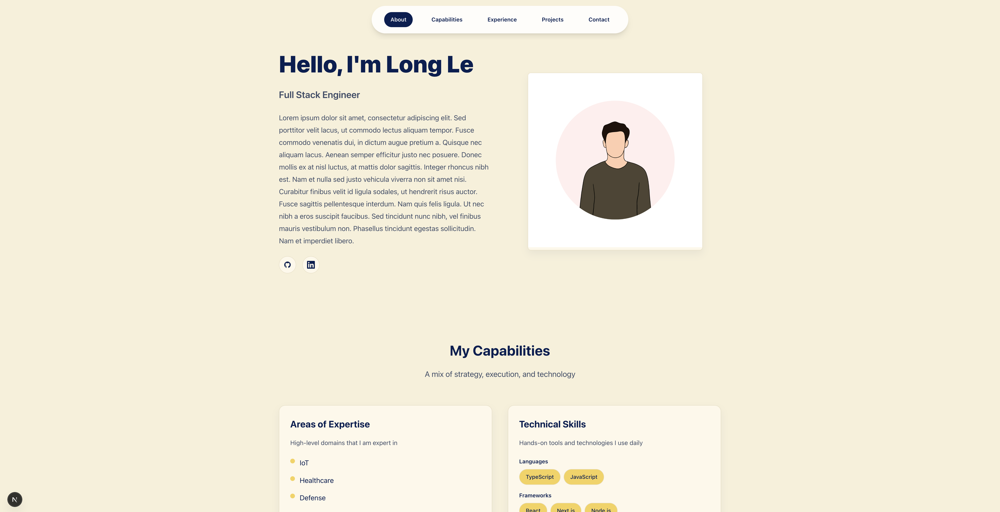

# Portfolio Website Generator
<p align="center">
  
</p>

A modern, responsive portfolio website generator that automatically syncs with GitHub repositories to display your projects. Built with Next.js, TypeScript, and Material-UI, featuring automatic project discovery, professional experience timeline, and customizable page styles.

## Abstract

This portfolio generator is designed for developers who want a beautiful, always-up-to-date portfolio website without manual maintenance. The system automatically fetches your public GitHub repositories, extracts project information from README files, and displays them in a professional timeline format. It supports both professional projects (manually maintained) and side projects (automatically synced from GitHub).

**Key Features:**
- 🚀 **Automatic GitHub Integration** - Fetches and syncs all public repositories weekly
- 🎨 **Multiple Page Styles** - Choose from predefined page layouts (Default, Aesthetic)
- 📱 **Fully Responsive** - Optimized for mobile, tablet, and desktop
- ⚡ **Server-Side Rendering** - Always displays current data with Next.js SSR
- 🐳 **Docker Ready** - Easy deployment with Docker Compose
- 🎯 **Smart README Parsing** - Extracts Abstract sections and images automatically with full markdown support
- 📊 **Professional Timeline** - Ready-made MUI Timeline for work experience
- 🎭 **Smooth Animations** - Framer Motion for interactive UI elements
- 🔍 **Project Detail Modal** - Click any project card to view full details with markdown-rendered content
- 🔗 **Dynamic URL Updates** - URL hash automatically updates as you scroll through sections
- 📝 **Markdown Rendering** - Project abstracts support markdown formatting (bold, italic, lists)

## Prerequisites

- **Node.js** 20.19.4 or higher
- **npm** or **yarn** package manager
- **Docker** (optional, for containerized deployment)
- **GitHub Personal Access Token** (optional, but recommended for higher rate limits)

## Quick Start

### 1. Clone the Repository

```bash
git clone <repository-url>
cd Portfolio
```

### 2. Install Dependencies

```bash
npm install
```

### 3. Initialize Configuration

```bash
npm run init:config
```

This creates default configuration files in the `config/` directory:
- `portfolio.json` - Your personal information and portfolio data
- `projects.json` - Project listings (auto-populated by GitHub sync)

### 4. Configure Your Portfolio

Edit `config/portfolio.json` with your information:

```json
{
  "name": "Your Name",
  "title": "Your Professional Title",
  "bio": "Your bio description",
  "email": "your.email@example.com",
  "githubUsername": "your-github-username",
  "domains": ["Full-Stack Development", "Cloud Architecture"],
  "skills": [
    {
      "category": "Languages",
      "items": ["TypeScript", "JavaScript", "Python"]
    },
    {
      "category": "Frameworks",
      "items": ["React", "Next.js", "Node.js"]
    }
  ],
  "experience": [
    {
      "company": "Company Name",
      "position": "Position Title",
      "startDate": "2020-01",
      "endDate": "Present",
      "description": "Job description and responsibilities",
      "achievements": ["Key achievement 1", "Key achievement 2"]
    }
  ],
  "socialLinks": {
    "linkedin": "https://linkedin.com/in/yourprofile",
    "twitter": "https://twitter.com/yourhandle",
    "website": "https://yourwebsite.com"
  }
}
```

### 5. Set Environment Variables

Create a `.env` file in the root directory:

```env
# GitHub Integration (Optional but recommended)
GITHUB_TOKEN=your_github_personal_access_token_here

# Sync Configuration
SYNC_INTERVAL_DAYS=7

# Page Style Selection
PORTFOLIO_THEME=default

# Server Configuration
PORT=3000
```

**Environment Variables Explained:**
- `GITHUB_TOKEN` (optional): GitHub Personal Access Token for higher API rate limits (5,000 req/hr vs 60 req/hr without token)
- `SYNC_INTERVAL_DAYS` (optional): Days between automatic GitHub syncs (default: 7)
- `PORTFOLIO_THEME` (optional): Page style selection - `default` or `aesthetic` (default: `default`)
- `PORT` (optional): Server port number (default: 3000)

### 6. Run Development Server

```bash
npm run dev
```

Your portfolio will be available at `http://localhost:3000`

## Configuration Guide

### Portfolio Configuration (`config/portfolio.json`)

The main configuration file contains all your personal information:

**Required Fields:**
- `name` - Your full name
- `title` - Your professional title/role
- `bio` - Brief biography/description
- `email` - Contact email address
- `githubUsername` - GitHub username for automatic repository syncing

**Skills Structure:**
Skills are organized by category for better presentation:

```json
"skills": [
  {
    "category": "Languages",
    "items": ["TypeScript", "JavaScript", "Python"]
  },
  {
    "category": "Frameworks",
    "items": ["React", "Next.js", "Node.js"]
  }
]
```

**Experience Structure:**
Professional experience entries with achievements:

```json
"experience": [
  {
    "company": "Company Name",
    "position": "Position Title",
    "startDate": "2020-01",  // Format: YYYY-MM
    "endDate": "Present",     // Or "YYYY-MM" for past positions
    "description": "Detailed job description...",
    "achievements": ["Achievement 1", "Achievement 2"]  // Optional
  }
]
```

**Profile Picture:**
- Place your profile picture in `config/profile-pic/` directory
- Supported formats: `.jpg`, `.jpeg`, `.png`, `.gif`, `.webp`
- If no local picture is found, the system automatically uses your GitHub avatar
- The picture is automatically copied to the public folder on initialization

### Projects Configuration (`config/projects.json`)

Projects are automatically managed by the GitHub sync service, but you can manually add professional projects:

**Professional Projects (Manual):**
```json
[
  {
    "id": "custom-project-id",
    "name": "Project Name",
    "description": "Project description",
    "abstract": "Project abstract",
    "category": "professional",
    "technologies": ["React", "TypeScript"],
    "githubUrl": "https://github.com/username/repo",
    "liveUrl": "https://project-demo.com",
    "image": "https://example.com/image.png"
  }
]
```

**Side Projects (Automatic):**
Side projects are automatically added from GitHub repositories. They must have:
- A README file
- An "Abstract" section in the README
- The first image in the README will be used as the project image

### Custom Styling (`config/custom.css`)

Create `config/custom.css` to add custom CSS overrides. This file is loaded after the default styles and allows you to customize any aspect of the design.

**Example:**
```css
/* Custom color overrides */
:root {
  --color-primary: #your-color;
  --color-accent: #your-accent-color;
}

/* Custom component styling */
.card {
  border-radius: 12px;
}
```

## GitHub Integration

### How It Works

1. **Initial Sync**: Runs automatically on first startup
2. **Scheduled Sync**: Runs weekly (configurable via `SYNC_INTERVAL_DAYS`)
3. **Full Sync Strategy**: 
   - Adds new repositories
   - Updates existing repositories
   - Removes repositories that no longer exist on GitHub
   - Preserves professional projects (never removed)

### README Format Requirements

For your GitHub repositories to be automatically included, your README must follow this format:

```markdown
# Project Name


or


## Abstract

Your project description and abstract content here. This section will be extracted and displayed on your portfolio.

## Features

Additional content...

## Installation

More content...
```

**Important Notes:**
- The "Abstract" section is **required** - repositories without it will be skipped
- The first image in the README will be used as the project image
- Images can be relative paths (e.g., `./screenshot.png`) or absolute URLs
- Relative paths are automatically resolved to GitHub raw content URLs

### Getting a GitHub Token

1. Go to GitHub Settings → Developer settings → Personal access tokens → Tokens (classic)
2. Click "Generate new token (classic)"
3. Select scopes: `public_repo` (read-only access to public repositories)
4. Copy the token and add it to your `.env` file

**Why use a token?**
- Without token: 60 requests/hour (may hit rate limits)
- With token: 5,000 requests/hour (recommended for reliability)

## Deployment

### Docker Deployment (Recommended)

#### Using Docker Compose

```bash
docker-compose -f docker/docker-compose.yml up --build
```

#### Manual Docker Build

```bash
# Build the image
docker build -f docker/Dockerfile -t portfolio .

# Run the container
docker run -p 3000:3000 \
  -v $(pwd)/config:/app/config \
  -v $(pwd)/public:/app/public \
  -e GITHUB_TOKEN=your_token \
  -e PORTFOLIO_THEME=default \
  -e SYNC_INTERVAL_DAYS=7 \
  portfolio
```

**Docker Compose Configuration:**
- Volume mounts: `config/` directory for configuration files
- Environment variables: Set in `.env` file or docker-compose.yml
- Health check: Automatic container health monitoring
- Auto-restart: Container restarts unless stopped

### Production Build

```bash
# Build for production
npm run build

# Start production server
npm start
```

### Environment-Specific Configuration

For production deployments, ensure:
- `.env` file is properly configured
- `config/` directory is mounted/accessible
- `GITHUB_TOKEN` is set for reliable syncing
- `PORTFOLIO_THEME` matches your preferred style

## Page Styles

The portfolio supports multiple page styles, selectable via the `PORTFOLIO_THEME` environment variable:

### Default Style
- Clean, minimalist design
- Professional color scheme
- MUI Timeline for experience section
- Smooth scroll animations

### Aesthetic Style
- Modern, artistic design
- Alternative layout and styling
- Enhanced visual elements

**Switching Styles:**
1. Update `PORTFOLIO_THEME` in `.env` file
2. Restart the application
3. Changes take effect immediately

## Project Structure

```
portfolio/
├── src/                    # Source code
│   ├── app/                # Next.js App Router
│   │   ├── layout.tsx     # Root layout with theme provider
│   │   ├── page.tsx       # Main page (style router)
│   │   ├── globals.css    # Global styles and CSS variables
│   │   └── layouts/       # Page layout components
│   │       ├── DefaultPage.tsx    # Default page layout
│   │       └── AestheticPage.tsx  # Aesthetic page layout
│   ├── components/        # Reusable React components
│   │   ├── ExperienceTimeline.tsx  # MUI Timeline component
│   │   ├── ProfilePicture.tsx      # Profile picture handler
│   │   └── ProjectCard.tsx         # Reusable project card with modal
│   ├── lib/               # Core libraries organized by domain
│   │   ├── config/        # Configuration management
│   │   │   └── index.ts   # Config file operations
│   │   ├── github/        # GitHub API integration
│   │   │   └── index.ts   # GitHub API client
│   │   ├── parsers/       # Content parsing utilities
│   │   │   └── markdown.ts # README parsing
│   │   ├── utils/         # General utilities
│   │   │   ├── profile-picture.ts # Profile picture logic
│   │   │   └── markdown-renderer.ts # Markdown to HTML renderer
│   │   └── core/          # Core application logic
│   │       ├── scheduler.ts # Cron scheduler
│   │       └── startup.ts   # Application startup
│   ├── services/          # Background services
│   │   └── github-sync.ts # GitHub sync service
│   └── types/             # TypeScript type definitions
│       ├── portfolio.ts   # Portfolio data types
│       └── project.ts     # Project data types
├── config/                # User configuration (gitignored)
│   ├── portfolio.json     # Portfolio configuration
│   ├── projects.json      # Projects data
│   ├── custom.css         # Custom CSS overrides
│   └── profile-pic/       # Profile picture directory
├── scripts/               # Utility scripts
│   └── init-config.ts     # Configuration initialization
├── __tests__/             # Unit tests
│   ├── lib/               # Library tests
│   │   └── parsers/       # Markdown parsing tests
│   └── resources/         # Test resources
├── docker/                # Docker configuration
│   ├── Dockerfile         # Docker build file
│   └── docker-compose.yml # Docker Compose config
└── public/                # Static assets
    └── config/            # Public config assets
```

## Runtime Behavior

### Configuration Updates

**Runtime Config Files** (changes take effect on next request):
- `config/portfolio.json` - Personal information
- `config/projects.json` - Project data
- `config/custom.css` - Custom styling

**Environment Variables** (require application restart):
- `PORTFOLIO_THEME` - Page style selection
- `GITHUB_TOKEN` - GitHub authentication
- `SYNC_INTERVAL_DAYS` - Sync frequency
- `PORT` - Server port

### GitHub Sync Behavior

- **Initial Sync**: Runs on first application startup
- **Scheduled Sync**: Runs weekly (configurable)
- **Manual Sync**: Restart the application to trigger sync
- **Username Changes**: Update `githubUsername` in `portfolio.json` → changes take effect on next sync

## Testing

The project includes a comprehensive test suite for markdown parsing functions:

```bash
# Run all tests
npm test

# Run tests in watch mode
npm run test:watch

# Run tests with coverage
npm run test:coverage
```

**Test Coverage:**
- Markdown abstract extraction (including full content with Key Features)
- Image extraction (HTML tags and markdown syntax)
- Image URL resolution (absolute and relative paths)
- Complete README parsing integration
- Tests use actual README.md file as test fixture

## Contributing

We welcome contributions! Here's how you can help:

### Development Setup

1. Fork the repository
2. Clone your fork: `git clone <your-fork-url>`
3. Create a feature branch: `git checkout -b feature/your-feature-name`
4. Install dependencies: `npm install`
5. Make your changes
6. Test your changes: `npm run dev`
7. Commit your changes: `git commit -m "Add your feature"`
8. Push to your branch: `git push origin feature/your-feature-name`
9. Open a Pull Request

### Contribution Guidelines

- **Code Style**: Follow existing TypeScript/React patterns
- **Testing**: Test your changes locally before submitting
- **Documentation**: Update README or code comments if needed
- **Commits**: Use clear, descriptive commit messages
- **Pull Requests**: Provide a clear description of changes

### Areas for Contribution

- 🎨 New page styles/themes
- 🐛 Bug fixes
- 📚 Documentation improvements
- ⚡ Performance optimizations
- 🧪 Testing improvements (Jest test suite included)
- 🌐 Internationalization
- 📱 Mobile responsiveness enhancements
- 🎯 Additional markdown rendering features

## Troubleshooting

### GitHub Sync Issues

**Problem**: Repositories not appearing
- **Solution**: Ensure README has "Abstract" section
- **Solution**: Check GitHub token is valid (if using)
- **Solution**: Check rate limits in logs

**Problem**: Rate limit errors
- **Solution**: Add `GITHUB_TOKEN` to `.env` file
- **Solution**: Increase `SYNC_INTERVAL_DAYS` to reduce frequency

### Configuration Issues

**Problem**: Changes not reflecting
- **Solution**: For config files - wait for next request
- **Solution**: For env vars - restart the application
- **Solution**: Clear browser cache

**Problem**: Profile picture not showing
- **Solution**: Ensure image is in `config/profile-pic/` directory
- **Solution**: Run `npm run init:config` to copy to public folder
- **Solution**: Check file format (jpg, png, gif, webp)

**Problem**: Project abstract not showing full content
- **Solution**: Ensure README Abstract section includes all content before next heading
- **Solution**: Check that markdown formatting is correct (use `**text**` for bold, `- item` for lists)
- **Solution**: Verify the abstract extraction includes the "Key Features" section if present

### Build/Deployment Issues

**Problem**: Docker build fails
- **Solution**: Ensure Node.js version matches (20.19.4)
- **Solution**: Check Docker has sufficient resources
- **Solution**: Verify all dependencies are in package.json

**Problem**: Port already in use
- **Solution**: Change `PORT` in `.env` file
- **Solution**: Stop other services using port 3000

## License

ISC License

## Support

For issues, questions, or contributions:
- Open an issue on GitHub
- Check existing issues for solutions
- Review the documentation

---

**Built with ❤️ using Next.js, TypeScript, and Material-UI**
